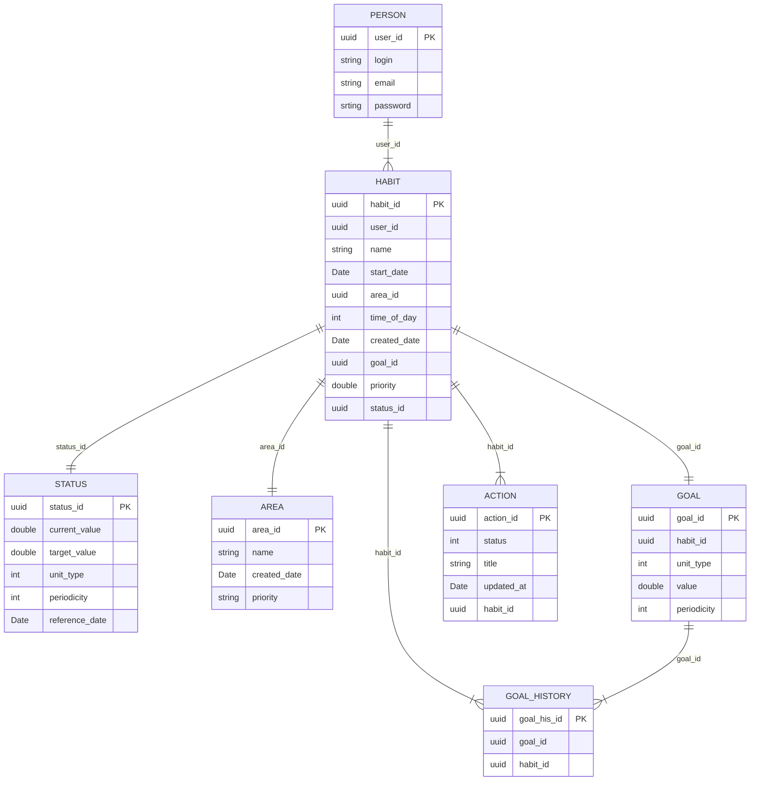

```mermaid
erDiagram
HABIT {
    uuid habit_id PK 
    uuid user_id 
    string name
    Date start_date
    uuid area_id
    int time_of_day
    Date created_date
    uuid goal_id
    double priority
    uuid status_id
}

PERSON {
    uuid user_id PK
    string login
    string email
    srting password
}

STATUS {
    uuid status_id PK
    double current_value
    double target_value
    int unit_type
    int periodicity
    Date reference_date
}

AREA {
    uuid area_id PK
    string name
    Date created_date
    string priority
}

GOAL {
    uuid goal_id PK
    uuid habit_id
    int unit_type
    double value
    int periodicity
}

GOAL_HISTORY {
    uuid goal_his_id PK
    uuid goal_id
    uuid habit_id
}

ACTION {
    uuid action_id PK
    int status
    string title
    Date updated_at
    uuid habit_id
}

PERSON ||--|{ HABIT: user_id
HABIT ||--|| STATUS: status_id
HABIT ||--|| AREA: area_id
HABIT ||--|| GOAL: goal_id
HABIT ||--|{ GOAL_HISTORY: habit_id
GOAL ||--|{ GOAL_HISTORY: goal_id
HABIT ||--|{ ACTION: habit_id
```

